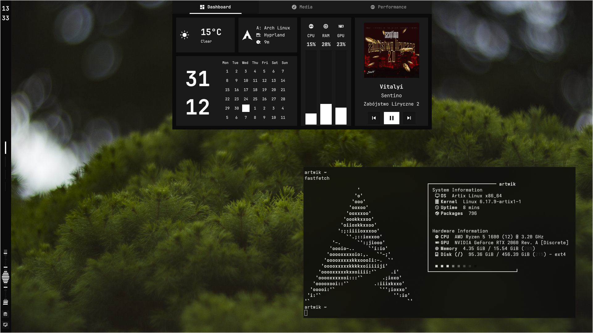
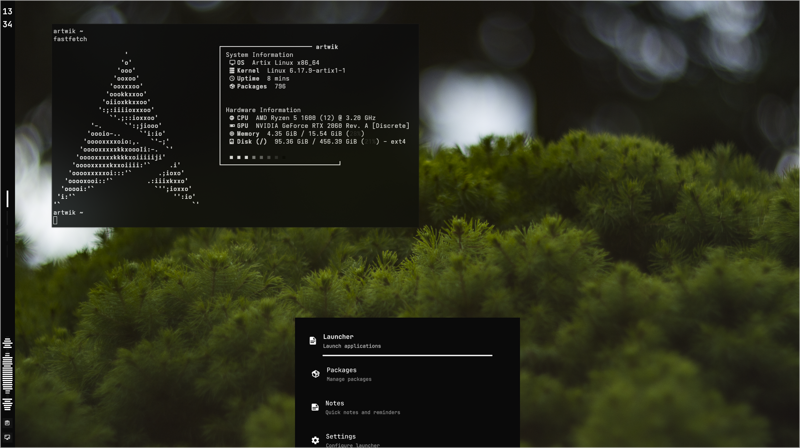
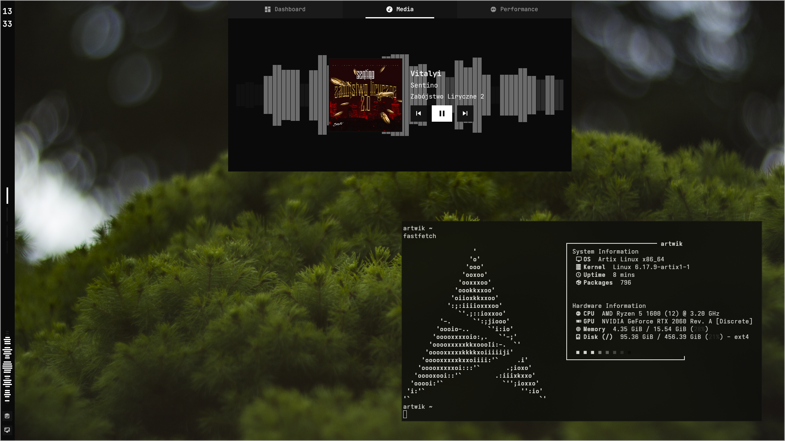

# Dart (Alloy Shell)

**A performance-focused desktop shell for Quickshell & Wayland**

[](https://github.com/Quickshell/Quickshell)
[](https://wayland.freedesktop.org/)

Dart provides a fluid UI with integrated system monitoring and deep customization via the Fuse App.

---

## 🖼️ Showcase

<table align="center">
  <tr>
    <td align="center"><b>Dashboard</b><br/></td>
    <td align="center"><b>Launcher</b><br/></td>
  </tr>
  <tr>
    <td align="center"><b>Clipboard</b><br/></td>
    <td align="center"><b>Media</b><br/></td>
  </tr>
</table>

---

## 🚀 Key Features

- **Unified Sidebar & Top Bar**: Toggle between positions with real-time scaling.
- **Dynamic Dashboard**:
    - **System Monitoring**: Real-time CPU, RAM, and GPU telemetry.
    - **Network**: Accurate upload and download traffic monitoring.
    - **GitHub Activity**: Scraped contribution graph.
    - **Calendar**: Integrated monthly view.
- **Smart Launcher**: Application filtering with math calculation (`= 2+2`) and web search shortcuts (`!y`, `!g`, `!r`).
- **Clipboard Manager**: History tracking with smart deduplication and instant copy-back.
- **Media Controls**: Integrated playback control and metadata display (requires `playerctl`).
- **Notification Center**: D-Bus compliant notifications with urgency-based styling.

---

## 🛠️ Requirements

- **Quickshell** (Latest master recommended)
- **DE/WM**: Tested **only** on **Hyprland**.
- **Fuse Suite**: Required for settings and system integration. [Repo](https://github.com/artwik22/fuse)

### Optional Dependencies
- `cava`: Audio visualization.
- `playerctl`: Media tracking and control.
- `grim` + `slurp`: Screenshot functionality.

---

## 📦 Installation

```bash
mkdir ~/.config/alloy
git clone https://github.com/artwik22/dart.git ~/.config/alloy/dart
cd ~/.config/alloy/dart
./run.sh
```

### ⌨️ Hyprland Bindings
Add these to your `hyprland.conf`:
```ini
bind = SUPER, R, exec, ~/.config/alloy/dart/open-launcher.sh
bind = SUPER, M, exec, ~/.config/alloy/dart/toggle-menu.sh
bind = SUPER, V, exec, ~/.config/alloy/dart/open-clipboard.sh
```

---

## 🔧 Customization

Primary customization is managed through the **Fuse** application. Available options include:
- **Design System**: Switch between 9+ curated color presets or define custom HEX colors.
- **UI Layout**:
    - **Sidebar**: Toggle visibility and change position (Left/Right/Top/Bottom).
    - **Dashboard**: Configure which system resources (CPU, RAM, GPU, Network) are displayed.
    - **Side Panel**: Switch between a classic Calendar or a live GitHub Activity graph.
- **Behavior**:
    - **UI Scaling**: Adjust the interface scale (75%, 100%, 125%).
    - **Performance**: Enable Low Performance mode to optimize for older hardware.
    - **Notifications**: Global toggle for D-Bus notifications and sound alerts.

<details>
<summary><b>Manual Configuration</b></summary>

Edit `~/.config/alloy/colors.json` directly for manual tweaks:
- `uiScale`: Toggle between `75`, `100`, or `125`.
- `lowPerformanceMode`: Set to `true` (or create `~/.config/alloy/low-perf`) to disable heavy animations.
- `sidebarPosition`: `"left"`, `"top"`, `"right"`, or `"bottom"`.
- `sidepanelContent`: `"calendar"` or `"github"`.
- `dashboardTileLeft`: `"battery"` or `"network"`.
- `accent`: HEX value for the primary accent color.

</details>

---

## 🤝 Acknowledgments
- [Quickshell](https://github.com/Quickshell/Quickshell) - The core engine.
- [cava](https://github.com/karlstav/cava) - Audio visualization.
